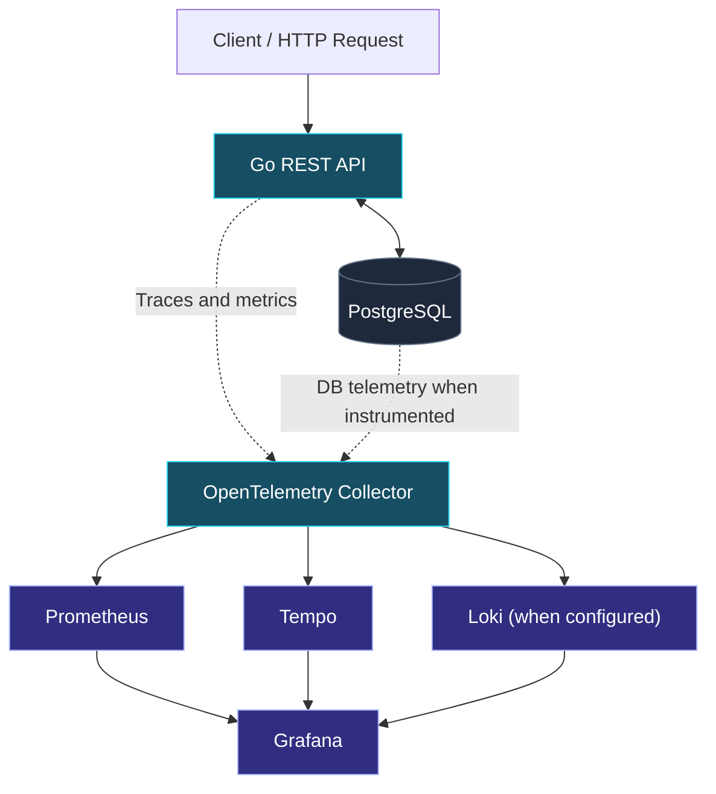

 <!--
-->

<div align="center">

<a href="https://github.com/saros-dev">
  
</a>

<a href="https://git.io/typing-svg">
  
</a>

<br/>

<a href="https://github.com/saros-dev?tab=repositories">
  
</a>
<a href="https://github.com/saros-dev/devops-shop">
  
</a>

</div>

---

## `$ whoami`

I'm Saros, an engineer focused on **DevOps, Site Reliability Engineering, and Observability**.

I enjoy understanding how systems work beneath the surface: how applications communicate, how infrastructure fails, where latency originates, and how automation makes deployments more repeatable.

My approach is hands-on:

* Build applications and infrastructure labs.
* Automate development and delivery workflows.
* Instrument applications to collect metrics and distributed traces.
* Investigate performance issues and system failures.
* Document findings so experiments become reusable engineering knowledge.

**My engineering philosophy:** Don't just make it work. Understand why it works, how it fails, and how to prove what's happening.

## `// currently_building`

### DevOps Shop

An evolving, hands-on DevOps and observability project built around a Go application, PostgreSQL, and an OpenTelemetry-based telemetry pipeline.

<div align="center">

<a href="https://github.com/saros-dev/devops-shop">
  
</a>

</div>

**Application layer**

* Go and REST API endpoints
* PostgreSQL integration
* Request handling and database interactions

**Observability layer**

* OpenTelemetry instrumentation and Collector
* Prometheus metrics
* Grafana dashboards
* Tempo distributed tracing

**Engineering objectives**

* Follow requests across application and database boundaries.
* Investigate latency using trace spans and database timing.
* Connect telemetry signals to make troubleshooting more effective.
* Build repeatable testing, delivery, and deployment workflows.

The goal is to move beyond *"the application is slow"* and identify which operation is slow, how much time it takes, and what the available telemetry can prove about the cause.

## `// system_architecture`

<div align="center">



<sub>Target architecture overview. Telemetry paths and log collection depend on the current implementation and configuration.</sub>

</div>

## `// technology_stack`

**Systems & development**

<a href="https://www.linux.org/"></a> <a href="https://git-scm.com/"></a> <a href="https://www.gnu.org/software/bash/"></a> <a href="https://go.dev/"></a> <a href="https://www.python.org/"></a>

**Containers & delivery**

<a href="https://www.docker.com/"></a> <a href="https://docs.github.com/en/actions"></a> <a href="https://about.gitlab.com/topics/ci-cd/"></a>

**Observability**

<a href="https://opentelemetry.io/"></a> <a href="https://prometheus.io/"></a> <a href="https://grafana.com/"></a> <a href="https://grafana.com/oss/tempo/"></a> <a href="https://www.postgresql.org/"></a>

<sub>Technologies shown here reflect my hands-on work and current learning focus; they do not imply equal proficiency in every tool.</sub>

## `// featured_repositories`

| Project                                                                               | What you'll find                                          |
| ------------------------------------------------------------------------------------- | --------------------------------------------------------- |
| [DevOps Shop](https://github.com/saros-dev/devops-shop)                               | Application engineering, PostgreSQL, and observability    |
| [DevOps Lab](https://github.com/saros-dev/devops-lab)                                 | Practical infrastructure and DevOps experiments           |
| [Linux Engineering Handbook](https://github.com/saros-dev/linux-engineering-handbook) | Linux administration, commands, and troubleshooting notes |
| [GitHub Telegram Notify](https://github.com/saros-dev/github-telegram-notify)         | GitHub event automation and notifications                 |
| [DevOps Task Manager](https://github.com/saros-dev/devops-task-manager)               | Application development and engineering practice          |

## `// engineering_principles`

```text
BUILD       → Create something that works.
INSTRUMENT  → Make its behavior observable.
TEST        → Verify expected behavior.
BREAK       → Reproduce realistic failure modes.
INVESTIGATE → Follow evidence, not assumptions.
AUTOMATE    → Make repeatable work reproducible.
DOCUMENT    → Turn findings into engineering knowledge.
```

## `// current_learning_path`

* Linux internals, networking, and troubleshooting
* Docker, container networking, and deployment workflows
* CI/CD with GitHub Actions and GitLab CI
* Infrastructure automation with Ansible and Terraform
* Kubernetes architecture, networking, and operations
* OpenTelemetry, distributed tracing, metrics, and logs
* SRE fundamentals, reliability, and incident investigation

## `// connect`

<div align="center">

<a href="https://github.com/saros-dev">
  
</a>

<br/><br/>

<sub>BUILD · OBSERVE · AUTOMATE · INVESTIGATE · REPEAT</sub>

</div>

<a href="https://capsule-render.vercel.app/">
  
</a>
